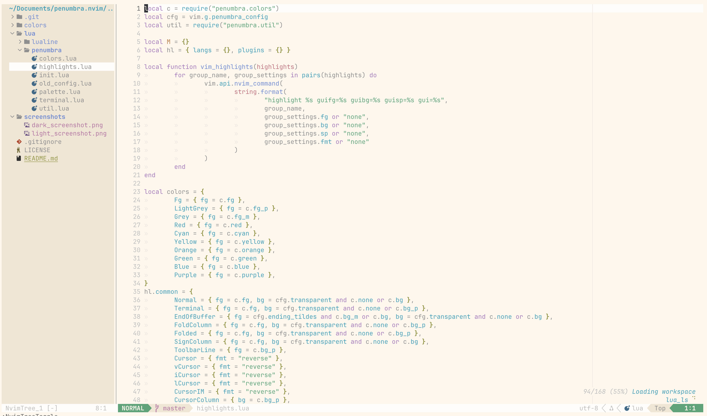
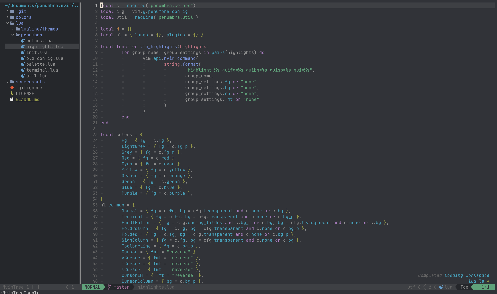
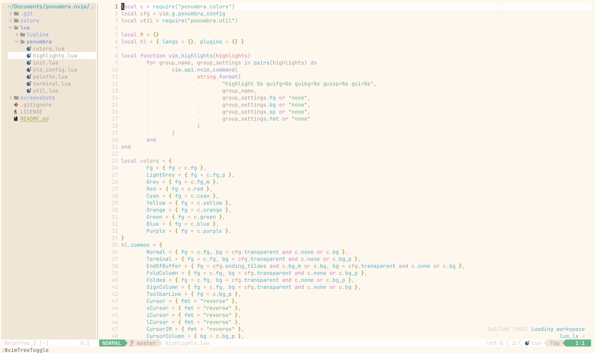
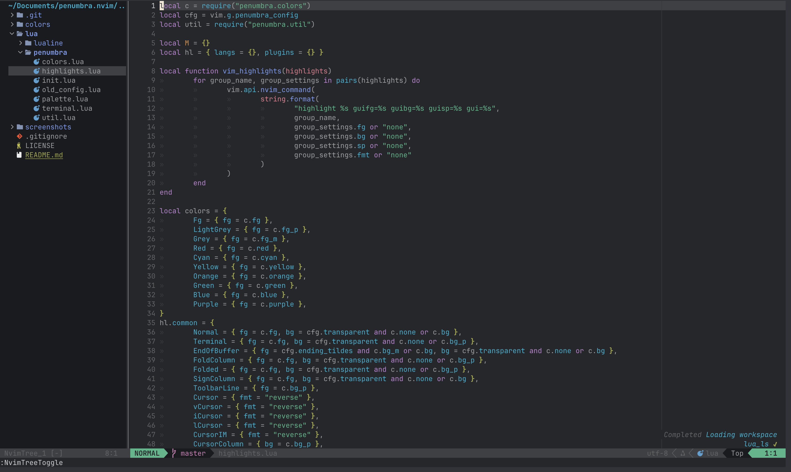
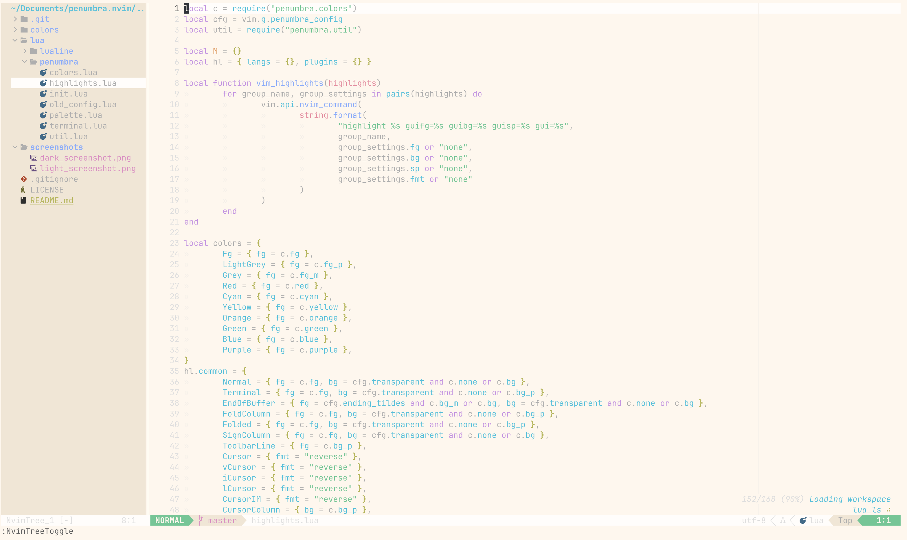
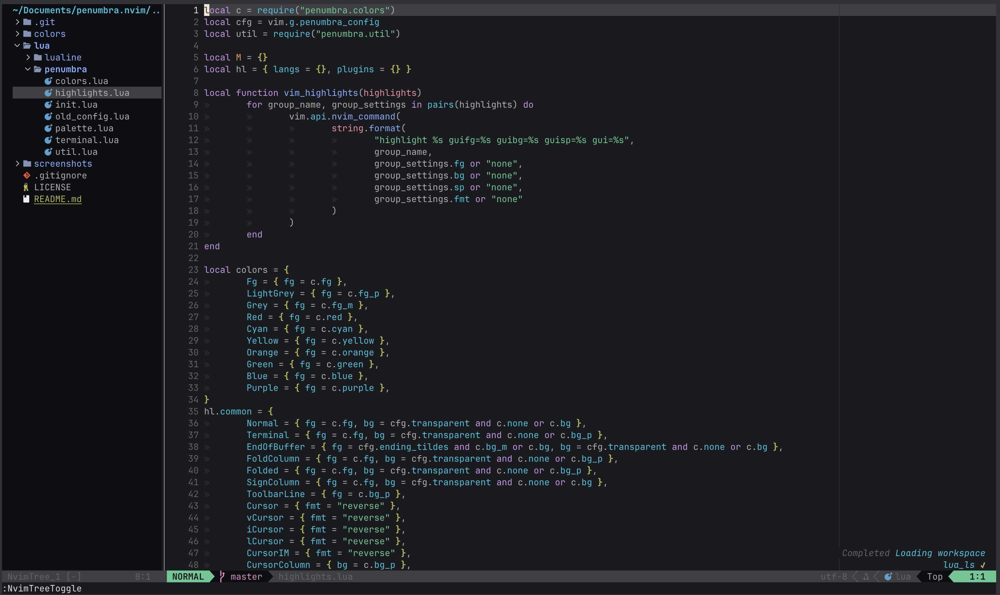

# penumbra.nvim

This is a fork of [penumbra.nvim](https://github.com/PointerDilemma/penumbra.nvim) that I maintain and use. 
I have updated all pallettes in the original fork to be what I like and, in some cases, what they should be according the the [penumbra repository](https://github.com/nealmckee/penumbra).
I am aim to support as many plugins as possible but for now it is mainly populated with plugins that I use.

## Screenshots

| Balanced light | Balanced dark |
|---|---|
|||
| Contrast light | Contrast dark |
|||
| More contrast light | More contrast dark |
|||
